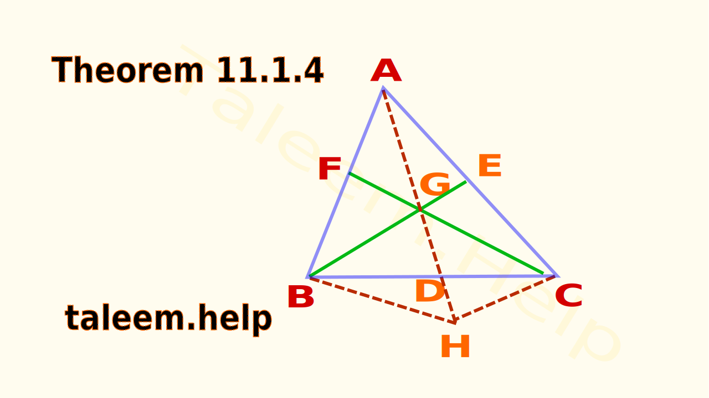

# Medians of a Triangle Are Concurrent  

---

## Book Statement  
> **“The medians of a triangle are concurrent and their point of concurrency is the point of trisection of each median.”**

---

## What the Statement Means  

| Concept | Plain-language meaning |
|---------|------------------------|
| **Median** | A segment from a vertex to the midpoint of the opposite side |
| **Concurrent** | Several lines meet at one single point (they are *not* necessarily equal in length or angle) |
| **Trisection** | That meeting point slices each median into three equal chunks → the part from the vertex to the centroid is **twice** the part from the centroid to the midpoint |

*Big takeaway*: The single intersection point of the three medians is called the **centroid** and it always divides every median in a **2 : 1** ratio.

---

## What We Will Prove  
1. **Concurrency** – all three medians meet at one point  
2. **2 : 1 Ratio** – that point divides each median so that  
   \[
   \text{(vertex → centroid)} = 2 \times \text{(centroid → midpoint)}.
   \]

---

## Proof Road-Map (Top-Level Steps)  

| Step | Core idea | Tool / Theorem used |
|------|-----------|---------------------|
| **1** | Build a parallelogram inside the triangle | Mid-point theorem |
| **2** | Parallelogram forces the third median to pass through the same point | “Diagonals of a parallelogram bisect one another” |
| **3** | Pre-marked equal segments give the **2 : 1** split | Simple segment counting |

---

---

## Detailed Proof (Using the Same Three Headings)

### **Step 1 — Parallelogram Construction**  
*Mid-point theorem*: The segment joining two mid-points of a triangle is parallel to the third side.  
- Because **E** and **F** are mid-points, the segments **GE** and **GF** are parallel to **HC** and **HB** respectively (after duplicating **AG** beyond **G** to **H**).  
- Two pairs of parallel sides make **HBCH** a parallelogram.

### **Step 2 — Parallelogram ⇒ Third Median Passes Through G**  
- In any parallelogram, diagonals bisect each other.  
- The diagonals **BH** and **CH** cross the base **BC** at its mid-point **D**.  
- The diagonal through **G** is therefore also a segment from **A** to the mid-point **D** → the *third* median.  
- Hence all three medians (**BE**, **CF**, **AD**) pass through **G** → **concurrent**.

### **Step 3 — Why the Ratio Is 2 : 1**  
- By construction, **AG = GH** (we copied the length).  
- The parallelogram logic showed **GD** equals each of those two segments.  
- Thus the median **AD** consists of **AG + GD + GH = 3 equal parts**.  
- From the vertex, you pass **two parts** to reach **G** and **one part** more to reach the midpoint →  
  \[
  \frac{\text{AG}}{\text{GD}} = 2 : 1.
  \]

---

*End of proof — ready for conversion into `note.json` when you give the word.*
