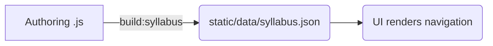

# 📚 Syllabus Specification — Version 1

> **Filename = Identity = Anchor** — every piece of content in Taleem.Help is uniquely addressed by its `filename`. The *syllabus* is the master index that binds these filenames into a navigable curriculum tree.

---

## 1  Purpose & Scope

The syllabus answers two questions:

1. **Where is each lesson located?** — chapters, exercises, and questions are arranged in a three‑tier tree under a textbook‑code (**tcode**).
2. **What kind of lesson is it?** — each leaf (`question`) declares its `type` so the front‑end can choose the correct viewer (player, notes, external link, etc.).

Runtime reads exactly **one file**: `static/data/syllabus.json`. No database queries are required.

---

## 2  Core Design Principles

I. *Filename = Identity* — a filename’s meaning is global and immutable.
II. Authoring uses a **DSL** (`SyllabusBuilder.js`); runtime consumes **pure JSON**.
III. Content‑type agnostic — new types can be added without changing the tree shape.
IV. Version locked: `syllabus‑v1` is frozen alongside `deck‑v1`.

---

## 3  Data Model & Allowed Content Types

| Level        | Required keys                                                 | Notes                            |
| ------------ | ------------------------------------------------------------- | -------------------------------- |
| **tcode**    | `tcodeName`, `filename`, `description`, `image`, `chapters[]` | Represents one book / subject.   |
| **chapter**  | `name`, `filename`, `exercises[]`                             | Filename can contain spaces.     |
| **exercise** | `name`, `filename`, `questions[]`                             | Holds a topic or theorem group.  |
| **question** | `name`, `filename`, `type`                                    | Leaf; `type` decides the viewer. |

Current `type` values:

| `type`    | Viewer route        | Typical extension       |
| --------- | ------------------- | ----------------------- |
| `"slide"` | `/player?filename=` | `deck.js` / `deck.json` |
| `"note"`  | `/notes?filename=`  | `.md`                   |
| `"exam"`  | `/exam?filename=`   | `.json` (future)        |
| `"link"`  | external redirect   | URL                     |

---

## 4  Canonical JSON Schema (excerpt)

```jsonc
[
  {
    "tcodeName": "fbise9mathold",
    "filename": "fbise9mathold",
    "description": "Math Class 9 Old Course",
    "image": "/bookcovers/math_9thFBSIE.png",
    "chapters": [
      {
        "name": "Ch‑10",
        "filename": "Ch-10 Congruent Triangles",
        "exercises": [
          {
            "name": "Theorems",
            "filename": "theorems",
            "questions": [
              { "name": "Congruent Triangles", "filename": "congruent_triangles", "type": "slide" }
            ]
          }
        ]
      }
    ]
  }
]
```

The complete file is generated at **`static/data/syllabus.json`**.

---

## 5  SyllabusBuilder DSL (authoring layer)

### 5.1  API Surface

```ts
const sb   = new SyllabusBuilder();
const book = sb.addTcode(tcodeName, meta);
const ch   = book.addChapter(name, filename);
const ex   = ch.addExercise(name, filename);
ex.addQuestion(name, filename, type); // type defaults to "slide"
```

### 5.2  Authoring Example

```js
export default function defineMath(builder) {
  const math = builder.addTcode("fbise9mathold", {
    description: "Math Class 9 Old Course",
    image: "/bookcovers/math_9thFBSIE.png"
  });

  const ch10 = math.addChapter("Ch‑10", "Ch‑10 Congruent Triangles");
  const ex   = ch10.addExercise("Theorems", "theorems");

  ex.addQuestion("Congruent Triangles", "congruent_triangles");
}
```

### 5.3  Generated Output (fragment)

```jsonc
{
  "name": "Congruent Triangles",
  "filename": "congruent_triangles",
  "type": "slide"
}
```

---

## 6  Build & Generation Script 🚀

1. Place or modify DSL files under `/syllabus/`.
2. Run **`npm run build:syllabus`** — alias for `node syllabus/genSyllabus.js`.
3. The script combines every DSL module and writes **`static/data/syllabus.json`** (pretty printed).
4. Front‑end reads that JSON directly; **no Svelte rebuild** is required.

```jsonc
// package.json (relevant extract)
{
  "scripts": {
    "dev:deploy": "nodemon index.js",
    "dev": "vite dev",
    "build": "vite build && postbuild",
    "preview": "vite preview",
    "build:syllabus": "node syllabus/genSyllabus.js"
  }
}
```

---

## 7  Validation & Testing

*Upcoming*: a Zod schema will hard‑lock `syllabus‑v1`.

Current safeguards:

* Duplicate filename detection (Map lookup inside builder).
* Required‑key checks during DSL construction.

---

## 8  Workflow Recap



---

## 9  Future Extensions (non‑breaking)

* Multi‑language fields (`lang`, `title_en`, `title_ur`, …)
* Tag arrays (`difficulty`, `concepts[]`)
* UI filters (by tag, difficulty)

---

## 10  Freeze Notice

`syllabus‑v1` is frozen alongside `deck‑v1`.
Breaking changes — e.g., nested exercises or per‑question metadata — will ship in **`syllabus‑v2`**.
